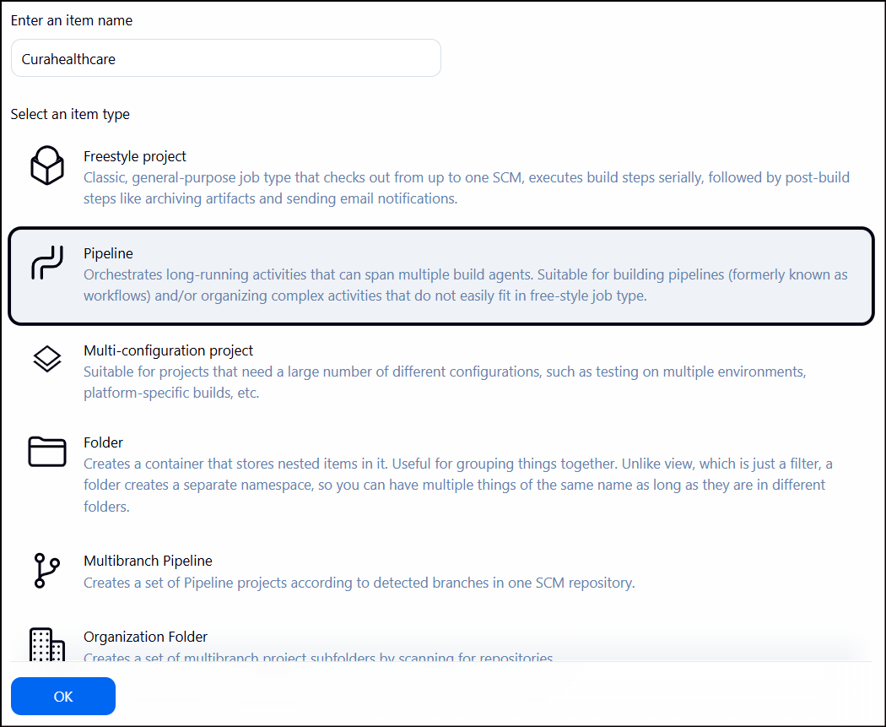

**Hello**🖐 **Automated Testing for Curahealthcare Demo Website with Selenium (Pytest, Page Object Model(POM), Allure Reports, Jenkins Pipeline)**

This project automates the testing of Cura Healthcare Service, covering key features such as login, appointment booking, and viewing history.

Instead of focusing only on the happy path, I also tested multiple edge cases to ensure the system behaves correctly under different scenarios.
These include:
   - Logging in without a username or password
   - Logging in with invalid credentials 
   - Booking an appointment without selecting a visit date 
   - Booking an appointment with a past date 
   - Viewing history when no appointments exist
___________________________________________

🎯 **Pre-requisites:**
- Python 3.11.9
- Any browsers(Chrome, Firefox, Edge)
___________________________________________

▶ **Test Execution**

Run commands: 
1. Install Dependecies:

       pip install -r requirements.txt
2. Run the test with Allure report:

       pytest -v --alluredir=reports/TestCase1
   or specifying browser

       pytest -v --browser=edge --alluredir=reports/TestCase1
    

**To run this on jenkins**
1. Add item name, click Pipeline and click OK
    
    
2. Scroll down and navigate to Pipeline then select "pipeline script from SCM"
    
   
3. Select Git
    
   
4. Paste the Repo URL and click Apply and Save
    
   
5. Click build now
    
   

    
   
   
    
