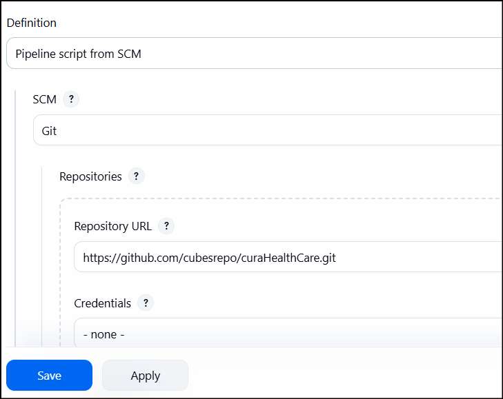

**Hello**🖐 **Automated Testing for Curahealthcare Demo Website with Selenium (Pytest, POM, HTML Reports, Jenkins Pipeline)**

This project tests the functionalities of CuraHealthcare, including valid and invalid login attempts, viewing history, and managing appointments.
___________________________________________

🎯 **Pre-requisites:**
- Python 3
- Any browsers(Chrome, Firefox, Edge)
___________________________________________

▶ **Test Execution**

Run commands: 
1. Install Dependecies:

       pip install -r requirements.txt
2. Run the test with html report:

       pytest -v --html=report.html 
   or specifying browser

       pytest -v --browser=edge --html=report.html
    

**To run this on jenkins**
1. Add item name, click Pipeline and click OK
   
2. Scroll down and navigate to Pipeline then select "pipeline script from SCM"
   
3. Select Git
   
4. Paste the URL and click Apply and Save
   
5. Click build now
   

    
   
   
    
